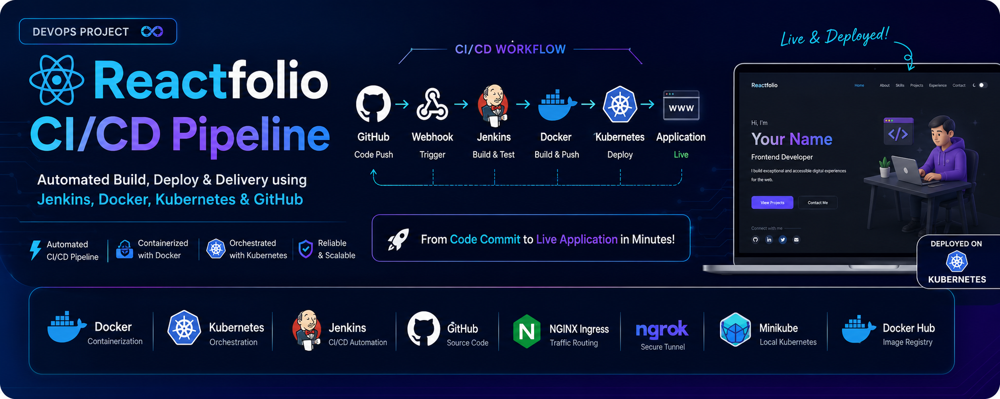
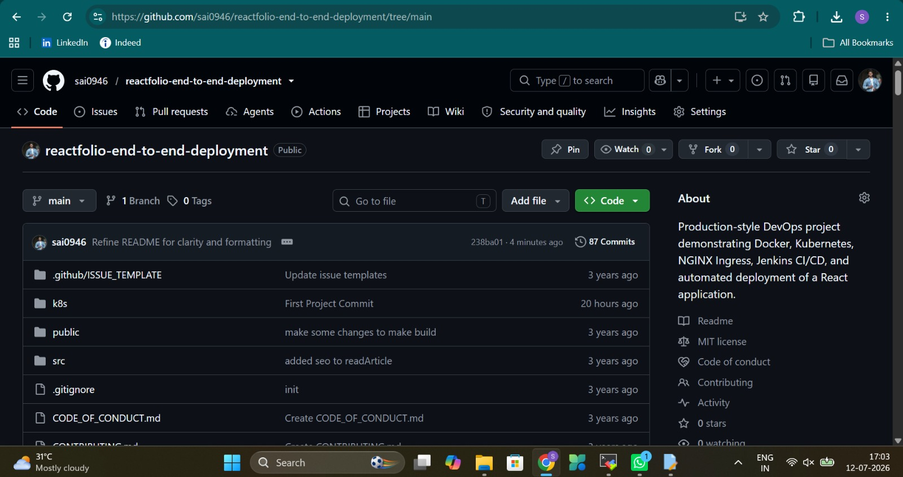
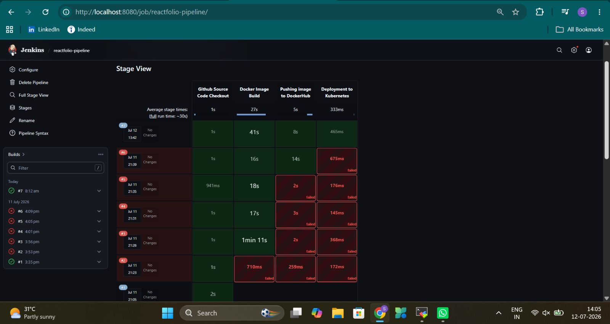
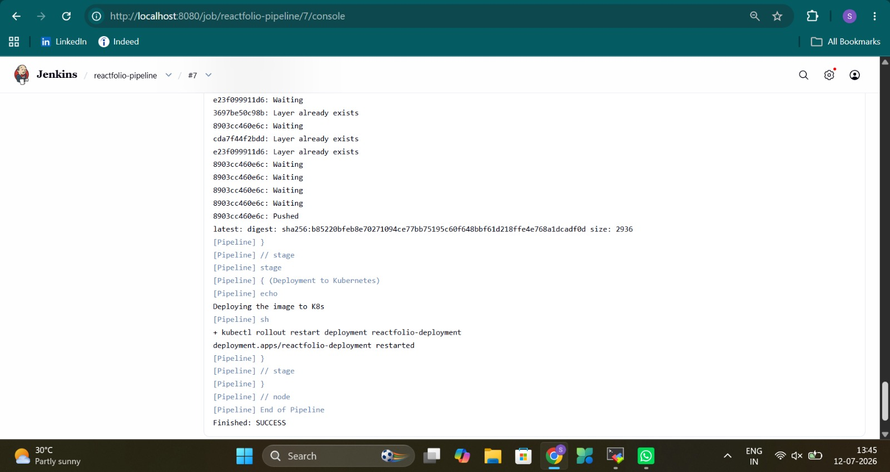
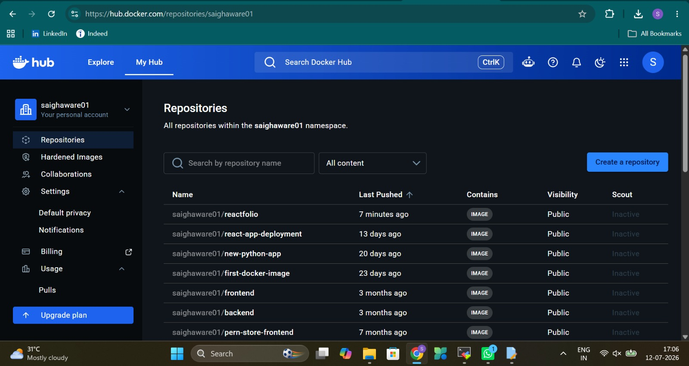
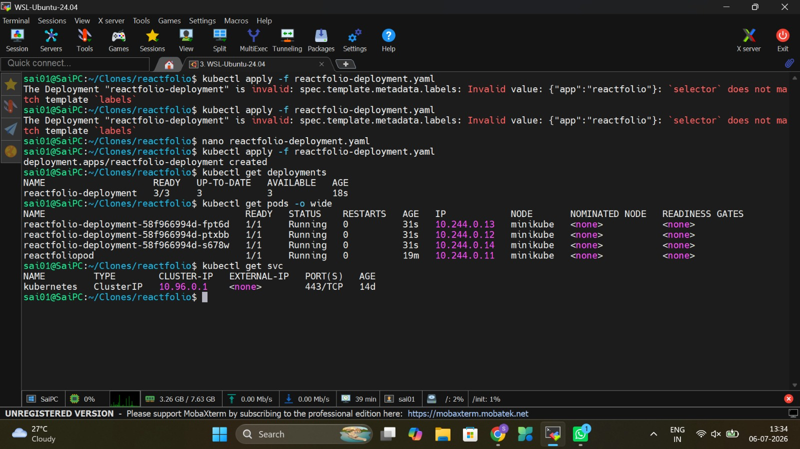
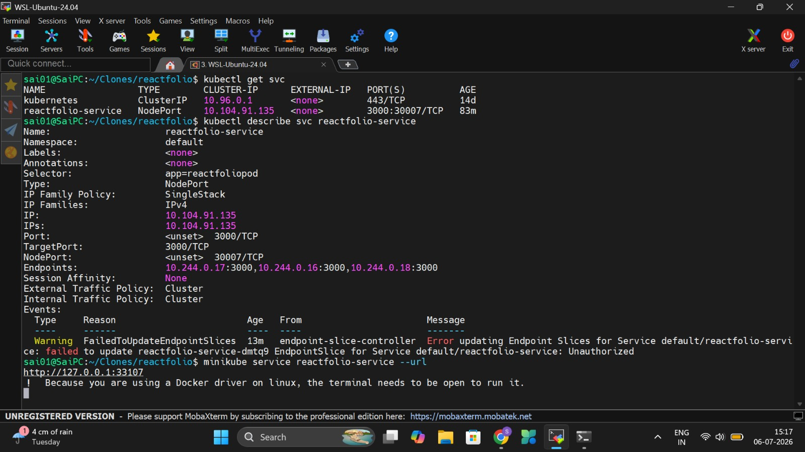
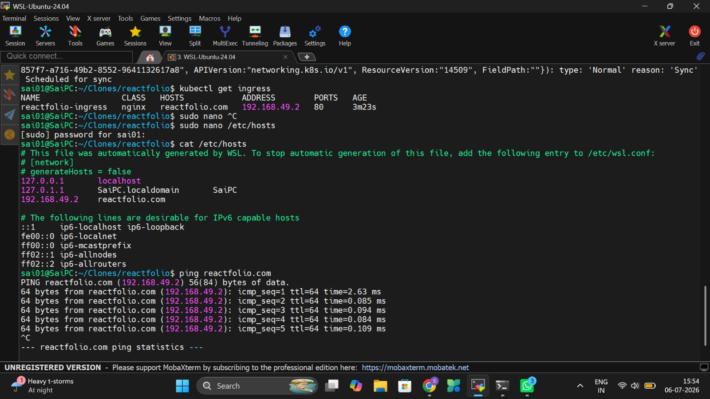
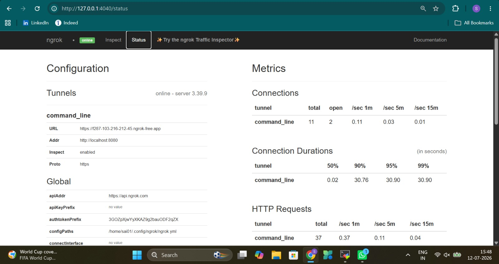
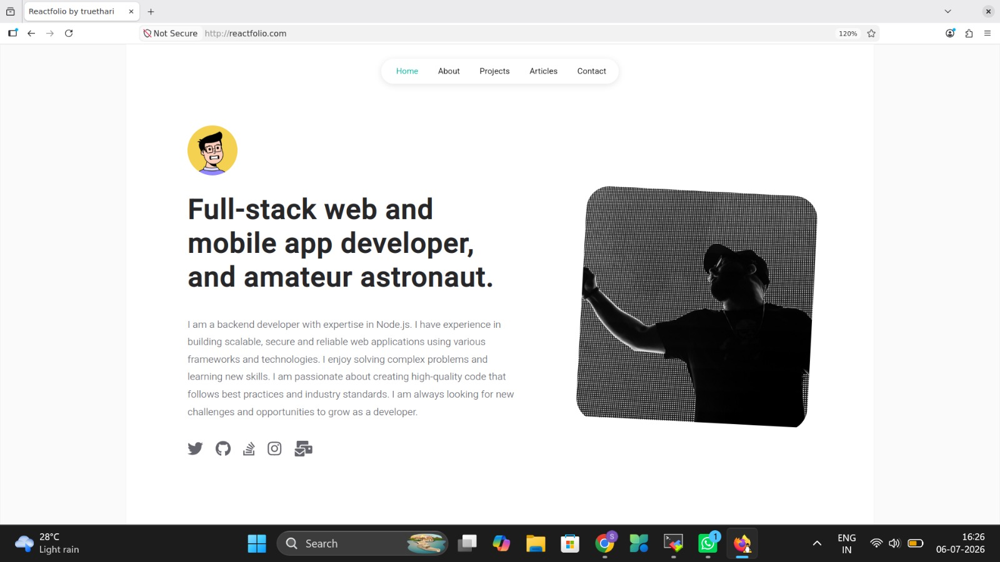

<p align="center">
  
</p>

# 🚀 Reactfolio End-to-End Deployment with Docker, Kubernetes & Jenkins CI/CD


## 📖 Overview

This repository demonstrates a complete **end-to-end DevOps
implementation** for deploying a React application using modern DevOps
practices.

Unlike a simple Docker deployment, this project covers the complete
deployment lifecycle:

-   Source Control with Git & GitHub
-   Docker Image Creation
-   Container Registry (Docker Hub)
-   Kubernetes Deployment
-   NGINX Ingress Routing
-   Jenkins Continuous Integration & Continuous Deployment
-   GitHub Webhooks
-   Automatic Deployment after every Git Push

The goal of this repository is educational. It demonstrates how
developers and DevOps engineers automate deployments from source code to
a running Kubernetes application.

------------------------------------------------------------------------

# 🙏 Acknowledgement

The frontend used in this project is based on the open-source
**Reactfolio** project by **@truethari**.

**Original Repository**

https://github.com/truethari/reactfolio

All credit for the React portfolio application belongs to the original
author.

This repository focuses on the **DevOps implementation**, including
Dockerization, Kubernetes manifests, Jenkins CI/CD pipeline, GitHub
Webhooks, deployment automation, and infrastructure documentation.

------------------------------------------------------------------------

# 🏗 Architecture

``` text
Developer
    │
    │ git push
    ▼
GitHub Repository
    │
    ▼
GitHub Webhook
    │
    ▼
ngrok Tunnel
    │
    ▼
Jenkins Pipeline
    │
    ├──────── Checkout Source
    ├──────── Docker Build
    ├──────── Docker Push
    └──────── Kubernetes Deployment
                     │
                     ▼
            Minikube Kubernetes
                     │
        Deployment → Service → Ingress
                     │
                     ▼
             Reactfolio Application
```

------------------------------------------------------------------------

# ✨ Features

-   End-to-End CI/CD
-   Automatic Deployment after Git Push
-   Dockerized React Application
-   Kubernetes Deployment with 3 Replicas
-   ClusterIP Service
-   NGINX Ingress Controller
-   Jenkins Pipeline (UI Based)
-   Docker Hub Integration
-   GitHub Webhooks
-   Local domain mapping in /etc/hosts/
-   Use of ngrok for exposing jenkins to Internet
-   Local Production-like Environment using Minikube

------------------------------------------------------------------------

# 🛠 Tech Stack

-   Frontend: React
-   Containerization: Docker
-   Registry: Docker Hub
-   Orchestration: Kubernetes (Minikube)
-   Ingress: NGINX Ingress Controller
-   CI/CD: Jenkins
-   SCM: Git & GitHub
-   Webhook Tunnel: ngrok
-   OS: WSL Ubuntu LTS
  
------------------------------------------------------------------------

# 📂 Project Structure

``` text
reactfolio/
│
├── src/
├── public/
├── Dockerfile
├── package.json
├── package-lock.json
├── README.md
│
└── k8s/
    ├── reactfolio-deployment.yaml
    ├── reactfolio-service.yaml
    └── ingress.yaml
```

------------------------------------------------------------------------

# 🛠️ Project Implementation Journey

This project was implemented incrementally to simulate a real-world DevOps deployment workflow rather than simply deploying an application.

### Phase 1 – Application Preparation
- Selected the open-source Reactfolio project for deployment.
- Cloned the repository and analyzed the project structure.
- Built and tested the application locally.

### Phase 2 – Containerization
- Created a production-ready Dockerfile.
- Built the Docker image locally.
- Tested the container.
- Tagged and pushed the image to Docker Hub.

### Phase 3 – Kubernetes Deployment
- Created Kubernetes Deployment manifest.
- Configured 3 application replicas.
- Created ClusterIP Service for internal communication.
- Configured NGINX Ingress Controller.
- Added custom domain mapping.
- Verified application accessibility through Ingress.

### Phase 4 – Jenkins CI/CD
- Installed Jenkins on Ubuntu (WSL).
- Created a Jenkins Pipeline using the Jenkins UI.
- Configured four pipeline stages:
  - Checkout Source Code
  - Docker Build
  - Docker Push
  - Kubernetes Deployment

### Phase 5 – Continuous Deployment
- Exposed Jenkins to the internet using ngrok.
- Configured GitHub Webhooks.
- Connected GitHub repository with Jenkins.
- Verified automatic pipeline execution after every Git push.

### Final Result

Every push to the GitHub repository automatically:

1. Triggers Jenkins via GitHub Webhook.
2. Checks out the latest source code.
3. Builds a new Docker image.
4. Pushes the image to Docker Hub.
5. Restarts the Kubernetes Deployment.
6. Deploys the latest version of the application automatically.

------------------------------------------------------------------------

# ⚙ CI/CD Workflow

``` text
Code Change
      │
git add .
git commit
git push
      │
      ▼
GitHub
      │
Webhook
      ▼
Jenkins
      │
Checkout Code
      │
Docker Build
      │
Docker Push
      │
kubectl rollout restart
      ▼
Updated Application
```

------------------------------------------------------------------------

# 🔄 Jenkins Pipeline Stages

## 1. Checkout Source Code

Downloads the latest code from GitHub into the Jenkins workspace.

## 2. Docker Build

Builds a Docker image using the Dockerfile in the repository.

## 3. Docker Push

Pushes the image to Docker Hub.

## 4. Kubernetes Deployment

Triggers a rolling restart so Kubernetes deploys the updated image.

------------------------------------------------------------------------

# ☸ Kubernetes Components

## Deployment

-   Maintains desired replicas
-   Performs rolling updates
-   Self-heals failed pods

## Service

-   ClusterIP for internal communication

## Ingress

-   Routes HTTP traffic to the ClusterIP service
-   Makes the application accessible using a domain inside Minikube

------------------------------------------------------------------------

# 📸 Screenshots

## GitHub Repository



---

## Jenkins Dashboard



---

## Jenkins Pipeline



---

## Docker Hub



---

## Kubernetes Pods



---

## Kubernetes Services



---

## Kubernetes Ingress



---

## Kubernetes Pods



---

## Final Application



------------------------------------------------------------------------

# 🚀 Local Setup

1.  Clone repository
2.  Install Docker
3.  Start Minikube
4.  Enable Ingress
5.  Apply Kubernetes manifests
6.  Install Jenkins
7.  Configure Docker permissions
8.  Configure kubeconfig for Jenkins
9.  Configure Docker Hub login
10. Configure GitHub Webhook
11. Push code and enjoy automated deployment

------------------------------------------------------------------------

# 🐞 Troubleshooting & Lessons Learned

During the implementation of this project, several real-world DevOps issues were encountered and resolved. These troubleshooting experiences significantly improved my understanding of Docker, Kubernetes, Jenkins, networking, authentication, and Linux permissions.

| Issue | Cause | Solution |
|--------|-------|----------|
| AWS Free Tier account activation issue | AWS account remained in incomplete setup state | Switched to a fully local production-like environment using Minikube and Jenkins |
| Docker daemon permission denied | Jenkins user was not allowed to access Docker socket | Added Jenkins user to the Docker group and restarted Jenkins |
| Docker Hub authentication failed | Jenkins was not authenticated with Docker Hub | Logged into Docker Hub and verified repository permissions |
| Docker push returned **insufficient_scope / authorization failed** | Incorrect repository permissions or authentication | Verified Docker Hub repository name and authenticated Jenkins |
| Git push authentication failed | GitHub removed password authentication | Generated and used a GitHub Personal Access Token (PAT) |
| Git push returned HTTP 403 | Repository authentication issue | Updated Git remote credentials and authenticated using PAT |
| Jenkins could not access Kubernetes | Jenkins user had no kubeconfig | Copied kubeconfig into Jenkins home directory |
| Kubernetes current-context not set | Jenkins kubeconfig was empty | Configured Minikube context for Jenkins |
| Minikube certificate permission denied | Jenkins user could not read Minikube certificates | Copied Minikube certificates into Jenkins directory and updated kubeconfig paths |
| Kubernetes deployment failed from Jenkins | Jenkins used a different Kubernetes configuration | Configured Jenkins to use its own kubeconfig and certificates |
| NodePort inaccessible from Windows browser | Minikube networking under WSL | Used Minikube IP and later configured Ingress for proper routing |
| React application showed blank page through Ingress | SPA routes were not forwarded correctly | Updated Ingress configuration to correctly route React requests |
| Ingress accessible only inside WSL | Windows hosts file was not mapped | Added local domain mapping where required and validated routing |
| GitHub Webhook returned HTTP 403 | Jenkins CSRF protection rejected webhook requests | Correctly configured Jenkins webhook endpoint and security settings |
| GitHub Webhook not triggering Jenkins | Incorrect webhook URL | Updated webhook URL to `/github-webhook/` |
| Jenkins inaccessible from GitHub | Jenkins running locally | Exposed Jenkins securely using ngrok |
| ngrok tunnel not persistent | Local tunnel closed with terminal | Ran ngrok in the background while testing |
| Kubernetes deployment did not refresh application | Deployment continued using existing Pods | Used `kubectl rollout restart deployment` to trigger rolling updates |
| Jenkins workspace confusion | Understanding where Docker builds occur | Learned that Docker images are built from the Jenkins workspace after Git checkout |
| ClusterIP understanding | Service was internal only | Introduced Ingress to expose the application using a domain instead of NodePort |
| Deployment vs Pod confusion | Initially created Pods manually | Switched to Deployments for replica management and self-healing |
| Jenkins Docker build failures | Docker permissions and workspace understanding | Fixed permissions and validated build context |

------------------------------------------------------------------------

# 📚 Learning Outcomes

This project provided practical experience with:

-   Git
-   Docker
-   Docker Hub
-   Kubernetes
-   Pods vs Deployments
-   Services
-   Ingress
-   Jenkins
-   CI/CD
-   GitHub Webhooks
-   Linux permissions
-   Production deployment concepts
-   Troubleshooting real DevOps issues

------------------------------------------------------------------------

# 👨‍💻 Author

**Sai Ghaware**

This project was created for learning modern DevOps practices and
demonstrating practical deployment skills for portfolio purposes.

------------------------------------------------------------------------

# 📄 License & Attribution

This repository includes a frontend derived from the original Reactfolio
project.

Frontend credit remains with the original author:

https://github.com/truethari/reactfolio

The DevOps workflow, containerization, Kubernetes configuration, Jenkins
pipeline, deployment automation, troubleshooting documentation, and
CI/CD implementation contained in this repository were independently
developed for educational and portfolio purposes.

------------------------------------------------------------------------

⭐ If you found this repository useful, consider giving it a star!